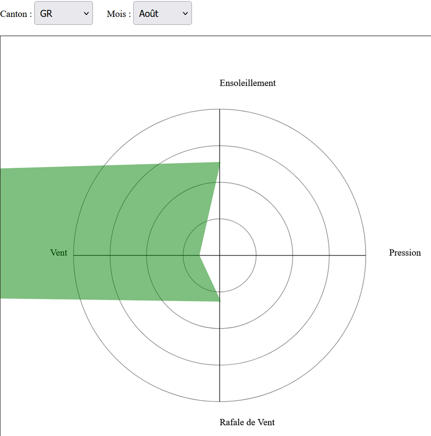
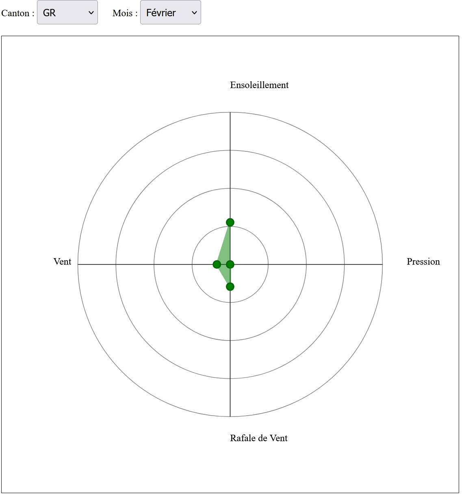
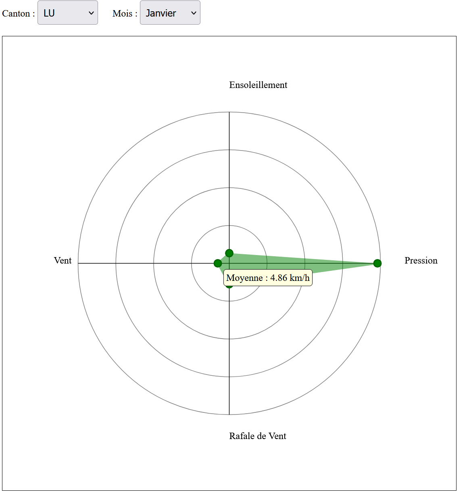
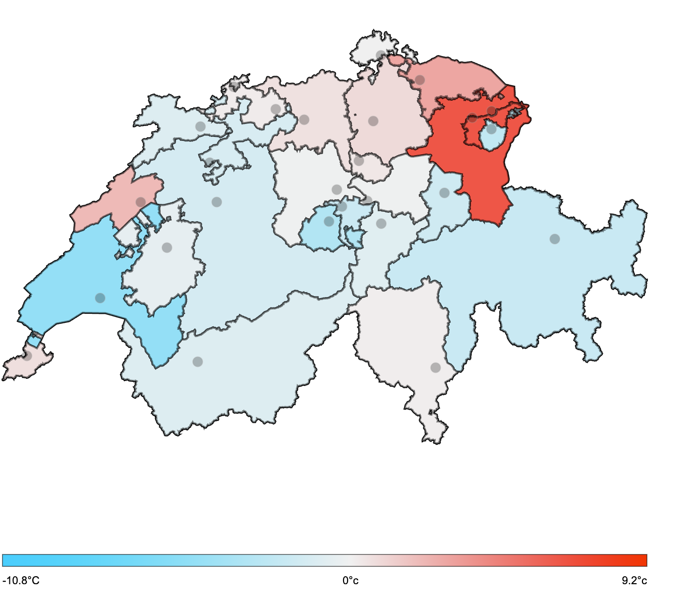
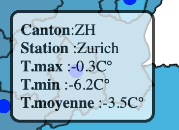
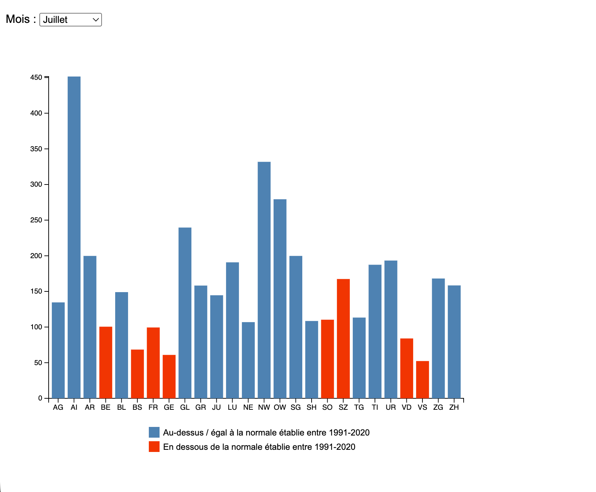
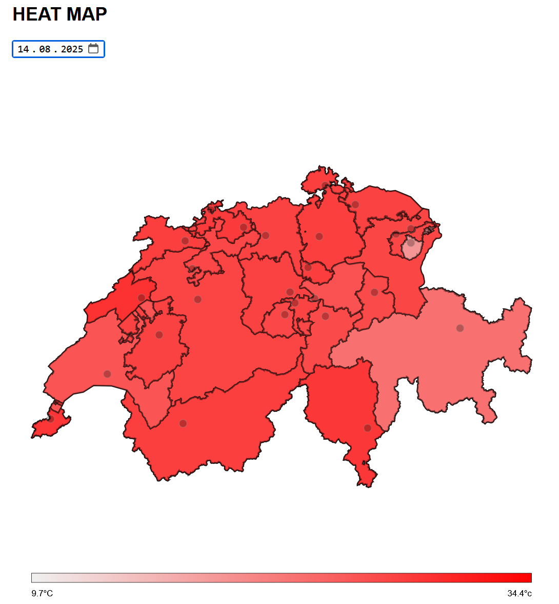
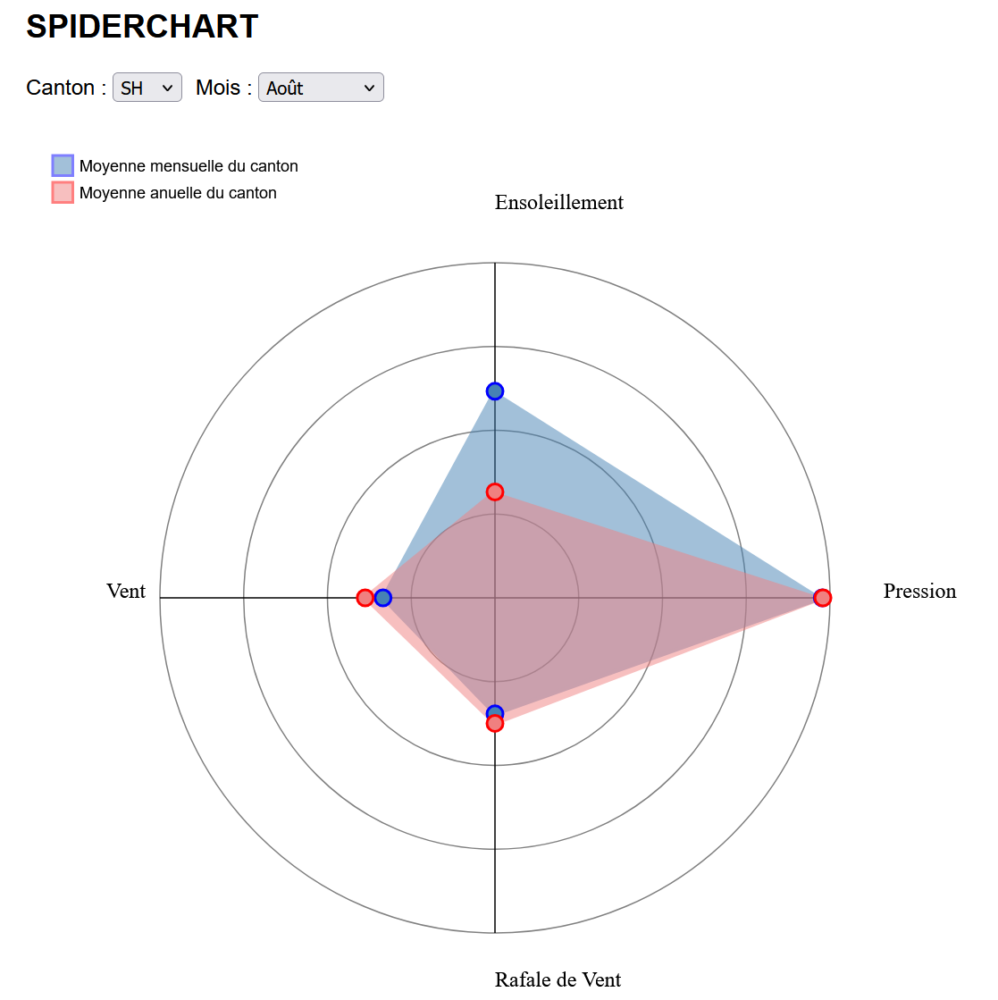

# Données météorologiques 2025
## Description du processus d'obtention des données
Dans un premier temps les données furent récupérés par l'intermédiaire de ce site [météo stat](https://meteostat.net/fr/). Chaque canton est représenté par une station météorologique et se télécharge en un fichier csv. Il y a un fichier par canton. Pourtant, il a été constaté que si les données initiales établissaient une station par chef-lieux, au moment où il a été question d'y ajouter les latitudes et longitudes, le site [météo suisse](https://www.meteosuisse.admin.ch/services-et-publications/applications/valeurs-mesurees.html#param=messwerte-lufttemperatur-10min&station=DAV&table=false) ne trouvait pas les-dites stations. Il a donc fallu prendre de nouvelles stations des cantons en question.

Puis, dans l'optique d'améliorer notre histogramme, nous avons été inspirées par le site qui établissait des [moyennes météorologiques](https://www.meteosuisse.admin.ch/services-et-publications/applications/ext/climate-normtables.html#https%3A%2F%2Fservice.meteoswiss.ch%2Fproductbrowser%2FproductDisplay%2Fclimate-normtables%3Flang=fr&cg1.parameter=rre150m0&cg1.normalPeriod=1991-2020&cg1.language=fr&cg1.productName=climate-reports-normtables), sur une période donnée. En téléchargeant le fichier qui rapportait la moyenne des précipitations dans chaque canton, de 1991 à 2020, nous avons établi un fichier csv en essayant de reprendre les mêmes stations que celles du fichier canton_meteo.csv. Or à deux reprises, il nous a fallu prendre une station différente. Nous avons donc pris Sattel au lieu de Gersau et Riedholz à la place de Grenchen, puisque Gersau et Grenchen n'étaient pas mentionnées.

Dans l'introduction des visualisations, nous avons également fait référence au [bilan climatologique 2025](https://www.meteosuisse.admin.ch/services-et-publications/publications/rapports-et-bulletins/2026/bulletin-climatologique-annee-2025.html) publié par l'Office fédéral météorologique et climatologique. Cela permet au lecteur de donner la possiblité de se renseigner avec plus de détails et donner du sens et un contexte pour expliquer ces visualisations.

## Présentation des données
Les données finales se présentent sous forme de tableau dans un fichier csv : "canton_meteo.csv". Ce fichier de 9490 lignes est le produit de l'assemblage des 26 fichiers cantonaux. Il contient 16 colonnes :
* canton = nom du canton
* ville = nom de la ville
* abb_station = diminutif de la station
* latitude
* longitude
* date = année-mois-jour heure
* tavg = température moyenne
* tmin = température minimale
* tmax = température maximale
* prcp = taux de précipitation en mm
* snow = taux de neige
* wdir = direction du vent
* wspd = vitesse du vent en moyenne en km/h
* wpgt = pic de rafale de vent en km/h
* pres = pression atmosphérique en hPa
* tsun = temps d'ensoleillement en min

Dans les 16, 5 colonnes furent rajoutées après le téléchargement des fichiers : *canton*, *ville*, *abb_station* (qui fait référence à l'abbrévation de la station), *latitude* et *longitude*. Ces ajouts ont un objectif de précision pour pouvoir distinguer les stations entre elles, et avoir une meilleure visualisation. Les cantons sont mentionnés par leur diminutif. La nécessité de mettre l'abbréviation de la station est un moyen de permettre d'être plus informé sur la provenance de ces valeurs, comme il est possible que certaines villes/régions possèdent plusieurs stations météorologiques, ayant différents objectifs. 
En ce qui concerne les données, il arrive que certaines colonnes manquent de données. Bien que nous n'ayons pas d'explications précises à ce sujet, plusieurs hypothèses peuvent être émises : la station mentionnée délèguent ce genre de données à une autre staiton de la même ville/région, ou alors a choisi de négliger ces données pour une raison externe.
La constance des données sélectionnées réside dans la datation. Chaque canton possède 365 lignes, chacune correspondant à un jour de l'année. Et toutes furent enregistrées à la même heure, soit *00:00:00*.

Nous avons créé un autre fichier csv, birèvement expliqué dans la section précédente : "moyennes_prcp_1991-2020.csv". Il contient 312 lignes, avec douze par canton, ainsi les 26 cantons ont les moyennes des précipitations, à niveau mensuel. Produit à partir des données fournies du fichier des normales établies entre 1991 et 2020, il possède une mise en page similaire au csv principal. Ainsi, le lecteur parvient à se retrouver facilement entre les deux tableaux. 

Ce fichier est divisé en 5 colonnes :

* canton -- nom du canton
* ville -- nom de la ville
* abb_station -- diminutif de la station
* altitude 
* date -- année-mois-jour
* prcp -- moyenne des précipitations

Il est possible de voir que les colonnes *canton*, *ville*, *abb_station* et *date* sont reprises du premier csv. Le choix de conserver le format année-mois-jour, malgré le fait que l'année et le jour soient marqué à 0, et seuls les mois changent, cela nous a permit de ne pas avoir à modifier les instructions du code pour pouvoir lire le fichier correctement.

## Étapes de pré-traitement des données
Le pré-traitement des données se résume par l'ajout de colonnes mentionné précédemment, ainsi que le changement effectué pour certaines stations, ne trouvant les coordonnées des stations de chef-lieux.
Dans un deuxième temps, nous avons du établir dans notre code un tableau de conversion des données car les noms des cantons dans notre tableau csv ne correspondait pas avec les données permettant de dessiner la carte de la Suisse (notamment des noms en suisse-allemand).

## Expliquer les visualisations produites

La heat map permet de visualiser les écarts de températures entre chaque canton sur le territoire de la suisse en fonction du jour sélectionné pour l'année 2025. Le gradient de couleur utiliser est le rouge pour les températures chaudes et le bleu pour les températures froides cf.[image_couleur_hm]. Une étiquette *tooltip*, visible par un mouseover, a également été créé afin d'avoir des informations supplémentaire comme le nom du canton, la température maximale et minimale ce jour-ci et également la température moyenne qui a été utilisée pour déterminer la couleur du canton cf.[image_tooltip_hm]. Il est également possible de cliquer sur les points représentant les différentes stations des cantons afin de mettre à jour la spiderchart, en fonction du choix. Le choix du jour dans l'année met à jour non seulement notre carte mais également les deux autres visualisations. 

Une spider-chart fut créée, dans le but de visualiser les moyennes de *wspd*, *wpgt*, *pres* et *tsun*, du canton sélectionné au préalable, ainsi que le mois choisi. Lorsque l'utilisateur percoit la chart, il se retrouve avec deux axes, qui indiquent quatre mesures différentes. Les noms inscrits à côté de leurs extrémités correspondantes diffèrent du nom de colonnes originales, pour une meilleure compréhension des données. L'image [image_axes] présente les valeurs de *wspd* sous *Vent*; *wpgt* sous *Rafale de Vent*; *pres* sous *Pression*; *tsun* sous *Ensoleillement*. Si le polygone bleu est établi à partir des moyennes mensuelles du canton sélectionné, le rouge permet une visualisation des moyennes à titre annuelles de ce même-canton.

Les 4 cercles de la spider-chart représente une échelle représentant, du plus petit au plus grand cercle, 25, 50, 75 et 100%. Si cette échelle s'applique pour les quatres mesures, leurs données très disparatre d'une colonne à une autre impliquèrent l'utilisation d'une échelle pour chaque mesure. Le 100% représente la valeur maximale d'une colonne. Si initialement, le principe était d'utiliser la valeure minimale comme point de départ dans la visualisation, il s'avère que cela créait des problèmes, puisque cela ne prenait pas en compte les cases sans données, cf.[image_problème]. Finalement, il fut plus simple d'établir des moyennes des valeurs minimales et maximales en référant directement au fichier-même, afin d'éviter les résultats faussés.

Cela peut expliquer les différences dans le dessin du graphique, où, par exemple, la courbe de la pression atteint plus rapidement la courbe des 75% et 100%, étant donné que ces valeurs minimales et maximales tournent autour de 945 et 1041, contrairement au vent, où les valeurs vont de 0 à 64. Les moyennes de chaque mesure diffèrent donc de manière drastique dans la visualisation. Il arrive aussi que certaines mesures n'aient pas de courbes à certains mois, par le manque total de mesures, comme expliqué auparavant, cf. [image_sanscourbe].

Pour expliciter la visualisation des données, une étiquette *tooltip* visible par un mouseover fut ajoutée (cf.[image_étiquette]), indiquant la moyenne calculée, avec l'unité correspondante à la mesure. C'est pour cette raison que furent ajoutés des points aux extrémités des courbes. L'image, étant un screenshot, n'indique pas la position du curseur, celui était placé sur le point de la courbe mesure le *vent*.

L'histogramme représente les précipitations dans chaque canton en fonction du mois choisi. La hauteur des barres représentent l'importance de celles-ci. L'axe Y représente les valeurs des précipitations en mm allant de 0 à 1041 (soit la valeur maximale des précipitations arrondie). L'axe X représente les différents cantons de suisse cf.[image_histo]. En plus de la formation classique de l'histogramme, nous y avons intégré une distinction colorée. En se basant sur le nouveau fichier csv basé sur les moyennes de précipitations, les couleurs bleue et rouges indique si la mesure 2025 est supérieure ou inférieure à la moyenne de 1991-2020. Le choix des couleurs pour ce graphe permet de rester dans le thème déjà établi dans les autres graphes. 

Si dans la spiderchart les couleurs ne sont pas vraiment représentatives de la récpercussion des résultat émis, mais servent plus à la distinction des polygones formés ([image_spidercouleurs]), ce n'est pas le cas pour les deux autres visualisations. Dans la heatmap, le rouge est associé à la chaleur, [image_heatcouleurs], et par conséquent, le choix du rouge dans l'histogramme permet de perpuétuer cette vision, cf. [image_histo], comme le rouge apparaît en cas d'insuffisance pluviale, donc une terre plus sèche, plus chaude. 

## Utilisation des IA génératives
L'usage des IA génératives est explicitée dans le code. 
Dans le code de la spider-chart, l'usage de l'IA servait à résoudre des problèmes dans l'apparition des résultats, ou dans le but de prélever des informations spécifiques, comme la ligne permettant de relever le mois dans la colonne *date*.
Pour ce qui est de la structure de la spider-chart, ou encore du *tooltip*, des sources internet sont à l'origine de ce code. 
[site_spider_chart](https://yangdanny97.github.io/blog/2019/03/01/D3-Spider-Chart)
[site_tooltip](https://d3-graph-gallery.com/graph/interactivity_tooltip.html)
[site_mouseover](https://medium.com/@kj_schmidt/show-data-on-mouse-over-with-d3-js-3bf598ff8fc2)
Concernant la heat map, les informations de mise en page de l'interface comme l'affichage du calendrier, format des dates, etc. proviennent directement du site de la librairie D3. 
[site D3](https://d3js.org/)
